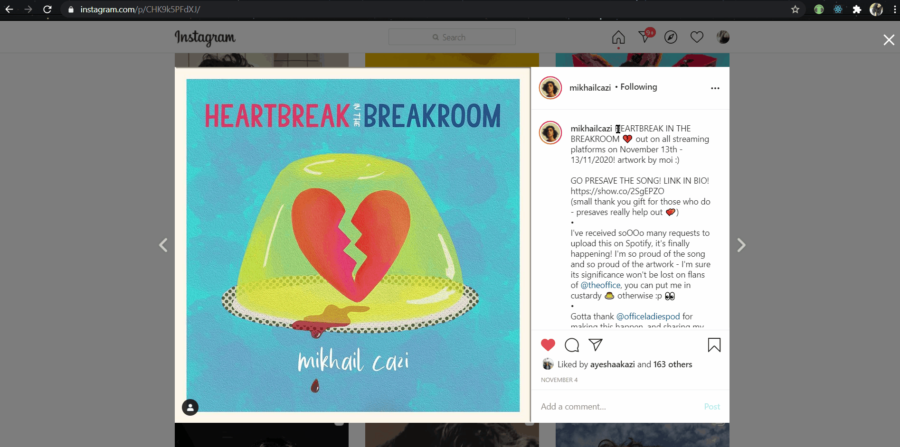

# SPOT

A Chrome extension that allows you to add *any* song to your spotify playlist, directly from your browser!

## Usage

- **Login  & Authentication**

    Click on 'sign-in & authenticate' to log in and grant access permissions.

    

- **Search for music & Preview**
     
    Enter the title of the song, and hit enter to search!

    

- **Add to playlist(s)**

    Select one or more playlists to add the selected song to, simultaneously.

    

- **Log-out**

    Click on the 'sign-out' button below your username to log-out.

    


## Features

- **Add a song playing on your active YouTube Tab:**

    If you're listening to a song on YouTube and wish to add it to one of your Spotify playlists, open SPOT in the same tab, and it will have the best match results ready for the music you are streaming on YouTube!

    

- **Search for text spotted on the internet -  Right Click & Highlight!**

    Ever came across a name of a song while scrolling through reddit/instagram? Search for the corresponding song on Spotify to add to your playlists!

    Steps:
    - Highlight SPOTTED text
    - Right Click & Select 'SPOTTED! Search on Spotify?'
    - Notification indicates that your search results are ready
    - Open the SPOT extension to add best match results to your playlists!

    

## Local Installation Instructions

### Chrome Extension
- Open Chrome Extensions and enable developer mode
- Clone the repo
- Click on "Load Unpacked" and point to the location of the extension
- Note the ID of the extension

### Spotify client
- Create a free spotify developer account https://developer.spotify.com/dashboard/login
- Once inside, create an app and give it a name
- Note the ```client ID```
- Click on EDIT SETTINGS and add redirect URI as ```https://<your-chrome-extension-id>.chromiumapp.org/```
- Done!

### Config Changes
- Open ```background.js```
- Replace ```CLIENT_ID``` and ```REDIRECT_URI``` with your own values
- Reload the extension
