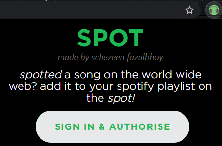
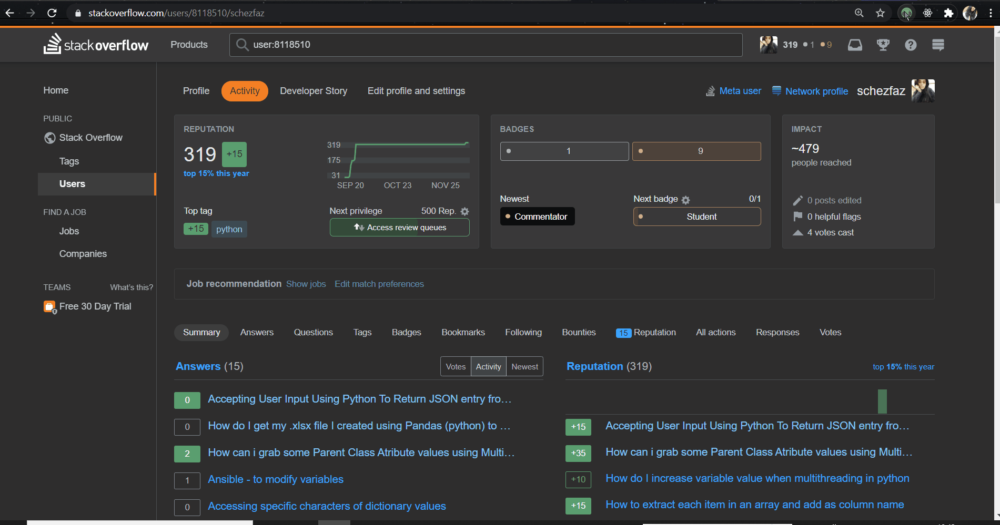

# SPOT
> An browser extension that allows you to directly add a song to your spotify playlist

 

## Usage

- Login  & Authentication



## Features

- **Listening on active YouTube Tab:**

    If you're listening to a song on YouTube and wish to add it to one of your Spotify playlists, open SPOT in the said tab, and it will have the best match  results ready for the music you are streaming on YouTube!


## Local Installation Instructions

### Chrome Extension
- Open Chrome Extensions and enable developer mode
- Clone the repo
- Click on "Load Unpacked" and point to the location of the extension
- Note the ID of the extension

### Spotify client
- Create a free spotify developer account https://developer.spotify.com/dashboard/login
- Once inside, create an app and give it a name
- Note the ```client ID```
- Click on EDIT SETTINGS and add redirect URI as ```https://<your-chrome-extension-id>.chromiumapp.org/```
- Done!

### Config Changes
- Open ```background.js```
- Replace ```CLIENT_ID``` and ```REDIRECT_URI``` with your own values
- Reload the extension
